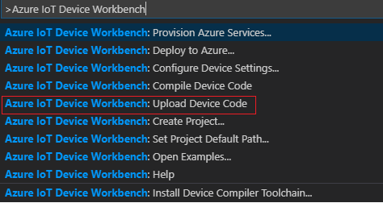

# IoT Devkit Dictionary

In this tutorial, you will learn how to configure DevKit to use Azure Speech Service and Oxford dictionaries API. This example includes:

* Create and use Azure Speech Service.
* Register and use Oxford Dictionaries API.

## About IoT DevKit

The [MXChip IoT DevKit](https://aka.ms/iot-devkit) (a.k.a. IoT DevKit) is an all-in-one Arduino compatible board with rich peripherals and sensors. You can develop for it using [Azure IoT Device Workbench ](https://aka.ms/azure-iot-workbench). And it comes with a growing [projects catalog](https://aka.ms/devkit/project-catalog) to guide you prototype Internet of Things (IoT) solutions that take advantage of Microsoft Azure services.


## The status flow of the example:


## Before you begin

To complete the steps in this tutorial, you need to do the following:

* Prepare your DevKit with [Getting Started Guide](https://microsoft.github.io/azure-iot-developer-kit/docs/get-started/).
* Upgrade to latest firmware (>= 1.6.0) with [Firmware Upgrading](https://microsoft.github.io/azure-iot-developer-kit/docs/firmware-upgrading/) tutorial.

## Set up the Environment

### Setting up the Azure Environment (Bing Speech API)

1. Log in to the [Azure portal](https://portal.azure.com/).

1. Create a new Speech Service by searching **Speech** in Azure portal and click **Create**. 

    

1. Provide the information including **Name**, **Location**, **Price Tier** and click **Create**. Wait for the deployment to finish and pin it to your dashboard for easy access.

1. Once the Speech Service was created, navigate to its main page. Click **Keys**. Copy KEY 1 and we will use it in the later session.

    


### Register for Oxford Dictionaries APIs

1. Visit the developer site of [Oxford Dictionaries](https://developer.oxforddictionaries.com/)

1. Click the **GET YOUR API KEY** and setup your account. This will prompt you to enter some information about your project.
    * Application type: Learning
    * Platform: Other-> IoT
    * Agree to terms and conditions

1. The website will send you an email and please follow the instruction to activate your account.

1. Sign into your account and click on “Credentials”

1. Copy the **Application Id** and **Application Keys**. We will use them in the following session.

    

### Run the application

1. Start VS Code first, and then connect the IoT DevKit to your computer.

1. Use `F1` or`Ctrl+Shift+P` (macOS: `Cmd+Shift+P`) to open the command palette, type **Azure IoT Device Workbench**, and then select **Open Examples...**.

	

	Select **IoT DevKit**.
		
	

	Then the **IoT Device Workbench Example** window is shown up.

	

1. Find the example of **IoT DevKit Dictionary** and click **Open Sample** button. 

1. A new VS Code window with a project folder in it opens.

	

1. Open the **DevkitDictionary.ino** file. Replace the first three variables with the keys copied earlier.

    | Variable | Value |
    | :------: | :----:|
    | SpeechServiceAppKey | Key 1 from Azure Speech Service |
    | OxfordDictionaryAppId | ApplicationId from the Dictionary API |
    | OxfordDictionaryAppKeys | ApplicationKeys from the Dictionary API |

1. Open the **iot_speechAPI_client.h** file. Update the following code based on the location of your Speech Service. You could find all the supported values in [Speech Service Rest APIs](https://docs.microsoft.com/en-us/azure/cognitive-services/speech-service/rest-apis)

    ```Cpp
        /*Replace the following definitions from the value in https://docs.microsoft.com/en-us/azure/cognitive-services/speech-service/rest-apis*/
        #define COGNITIVE_API_TOKEN_URL "https://westus.api.cognitive.microsoft.com/sts/v1.0/issueToken"
        #define COGNITIVE_API_TOKEN_HOST "westus.api.cognitive.microsoft.com"
        #define INTERATIVE_SPEECH_URL "https://westus.stt.speech.microsoft.com/speech/recognition/conversation/cognitiveservices/v1?language=en-US"

    ```

1. Open the command palette and select **Azure IoT Device Workbench: Upload Device Code**.

   

1. VS Code then starts verifying and uploading the code to your DevKit. 

## Test the project

1. Press and hold the A button while saying the word. The recording time is 2 seconds. 

1. Release Button A to stop recording. Wait for the request to be processed.

1. The definition of the word will appear on the screen. Press button B to scroll the definition. 

1. To start another quest, press A and say another word.

## Coding Exercises

### Changing Dictionary Language

The dictionary language can also be changed. The URL in the function app (named string url) can be changed to a variety of languages, documented [Supported languages](https://developer.oxforddictionaries.com/documentation/languages)

### Changing Dictionary Type

[API Documentation](https://developer.oxforddictionaries.com/documentation) shows how to call each API and other functions provided by Oxford Dictionaries.
These include translations, synonyms (Thesaurus) and other functionalities. 


## Problems and feedback

If you encounter problems, you can find [FAQs](https://microsoft.github.io/azure-iot-developer-kit/docs/faq/) if you encounter problems or reach out to us from the channels below.
